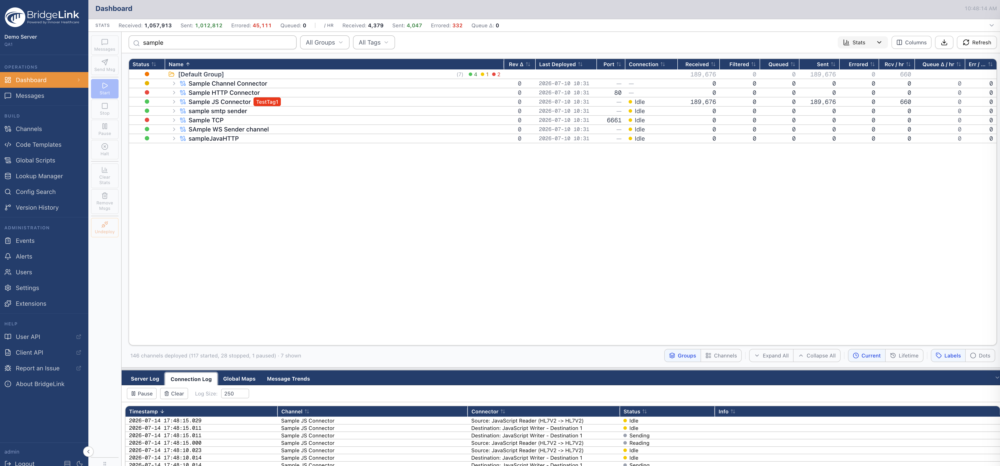
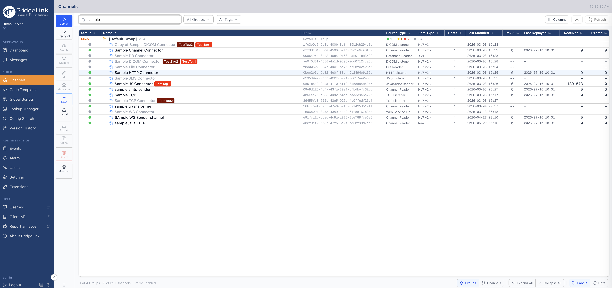
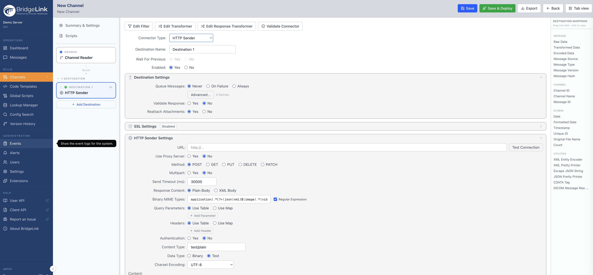

<div align="center">


# BridgeLink Web Admin

**A modern, browser-based administration console for the BridgeLink integration engine.**

</div>

---

## Overview

BridgeLink Web Admin is the web-based successor to the legacy desktop administrator. It runs
as a lightweight Node.js server that serves the UI to your browser and proxies calls to a
BridgeLink server over its REST API.

- **Full-featured** — dashboard, channel management, message browsing, events, alerts, users,
  and server settings, with feature parity to the desktop client.
- **Zero data at rest** — the server stores no channel data or PHI; every browser holds its own
  authenticated session and talks to your BridgeLink server directly through the proxy.
- **Points at any server** — connect to any reachable BridgeLink instance; lock it to a single
  server or offer a curated list.
- **Extensible** — a plugin system lets you add administration surfaces without forking the app.

> BridgeLink Web Admin is versioned in lockstep with BridgeLink. Use a build whose version
> matches (or is newer than) your BridgeLink server.

## Features

- **Dashboard** — live channel/connector status, message statistics, and deployment state.
- **Channels** — browse, edit, deploy, enable/disable, and organize channels into groups; a full
  channel editor with source/destination connectors, transformers, and filters.
- **Message Browser** — search, inspect, reprocess, and resend messages with per-connector views.
- **Events, Alerts, Users** — audit-event browsing, alert status, and user administration.
- **Settings** — server, data-pruner, and administration settings.
- **Code Templates & Global Scripts** — manage shared code libraries and scripts.
- **Productivity** — resizable/reorderable table columns, dark mode, adjustable view density, and
  a built-in code editor with syntax highlighting.

## Screenshots

<div align="center">

**Dashboard** — live channel status, throughput statistics, and server logs


**Channels** — browse, search, and organize channels; deploy and manage from one place


**Channel editor** — configure source and destination connectors, transformers, and filters


</div>

## Requirements

- A running **BridgeLink server** (reachable over HTTPS) to administer.
- To run the app server:
  - **Docker** 20.10+ (recommended), **or**
  - **Node.js 22.x LTS** for a native install / local development.
- A modern browser (current Chrome, Edge, Firefox, or Safari).

See [System Requirements](docs/customer/SYSTEM-REQUIREMENTS.md) for sizing and network details.

## Getting started

### Option A — Docker (recommended)

```bash
# point the app at your BridgeLink server and start it
BRIDGELINK_SERVER_URL=https://your-bridgelink-server:8443 \
  docker compose up -d
```

Then open **http://localhost:3000** and sign in with your BridgeLink credentials.

Full walkthrough (TLS, bring-your-own cert, upgrades): [Docker install guide](docs/customer/INSTALL-DOCKER.md).

### Option B — From source

```bash
npm install
BRIDGELINK_SERVER_URL=https://your-bridgelink-server:8443 npm run dev
```

Open **http://localhost:3000**. For a production build:

```bash
npm run build
npm run start
```

A native tarball install is also documented in the [Tarball install guide](docs/customer/INSTALL-TARBALL.md).

## Configuration

Configuration is via environment variables (copy [`.env.example`](.env.example) to `.env.local` for
local runs). The most common:

| Variable                         | Description                                                                                                  |
| -------------------------------- | ------------------------------------------------------------------------------------------------------------ |
| `BRIDGELINK_SERVER_URL`          | The BridgeLink server the UI connects to. Used as the default upstream and single-server lock.               |
| `BRIDGELINK_ALLOWED_SERVERS`     | Comma-separated allowlist of servers; login shows a picker. Leave with the single URL to lock.               |
| `PORT`                           | Port the app server listens on (default `3000`).                                                             |
| `SSL_CERT_FILE` / `SSL_KEY_FILE` | Absolute paths to a TLS cert + key to serve the UI over HTTPS. Omit for plain HTTP behind a proxy.           |
| `BRIDGELINK_CA_CERT`             | CA/self-signed cert that signed your BridgeLink server, to enable full TLS verification on the upstream hop. |
| `COOKIE_SECURE`                  | Force the session cookie `Secure` flag on/off (auto-detected by default).                                    |

The proxy only relays requests to servers it is configured to allow (an SSRF guard). With no
allowlist set, a build is closed by default to the host it is served from. See `.env.example` for
the full list and the security notes.

## Security

- The app server never persists channel data or PHI — it is a stateless proxy plus session store.
- Requests are relayed only to explicitly allowed BridgeLink servers.
- Serve the UI over HTTPS in production (`SSL_CERT_FILE`/`SSL_KEY_FILE`, or terminate TLS at a proxy).

## Plugins

Administration surfaces can be added through a plugin system without modifying the core app. This
open-source distribution ships with the core plugin set; additional commercial plugins are
available separately.

## Development

```bash
npm install
npm run dev          # start the dev server (http://localhost:3000)
npm run ci           # type-check, lint, format-check, and unit tests
npm run build        # production build
```

The stack is **Next.js** (App Router) + **React** + **TypeScript** (strict) + **Tailwind CSS**,
with an in-app code editor powered by Monaco.

## License

Distributed under the Business Source License (BSL). See [LICENSE](LICENSE) for the full terms.

## About

BridgeLink and BridgeLink Web Admin are developed by
[Innovar Healthcare](https://www.innovarhealthcare.com/).
